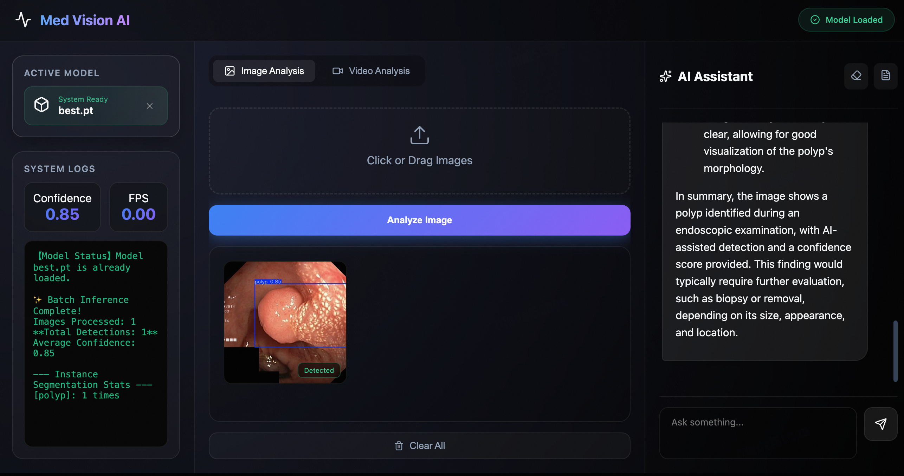

 # Med Vision AI Agent 🩺

[](https://modelscope.cn/studios/Zaoshangzhou/Med-Vision-AI-Agent-v0.2/summary)


**Next-Generation Medical Imaging Analysis Platform**  
结合 **YOLO** 实时目标检测与 **Qwen-VL** 多模态大模型的智能医疗辅助诊断系统。

<!-- 项目截图展示 -->
<p align="center">
  
</p>

---

## 🌟 Live Demo (在线体验)

The project is deployed on ModelScope Studios. Feel free to try it out!  
本项目已部署至魔塔社区（ModelScope），欢迎在线试用！

👉 **[Click here to try Med Vision AI Agent | 点击立即体验](https://modelscope.cn/studios/Zaoshangzhou/Med-Vision-AI-Agent-v0.2/summary)**

*If you find this project useful or interesting, please give us a star on GitHub and a like on ModelScope! 🌟*  
*觉得好用或有趣的话，请务必在 GitHub 点个 Star，并在魔塔社区点个赞，谢谢支持！*

---

## 📖 Introduction (项目介绍)

**Med Vision AI Agent** is a specialized web application designed to assist medical professionals in analyzing endoscopic images (Gastroscopy/Colonoscopy). It streamlines the workflow from lesion detection to diagnostic reporting.

**Med Vision AI Agent** 是一款专为内镜（胃镜/肠镜）医生设计的辅助诊断网页应用。它允许用户上传自定义模型，实现从“病灶检测”到“AI 辅助诊断”再到“报告生成”的全流程自动化。

### Core Features (核心功能)

1.  **🔍 Flexible Model Integration (灵活的模型加载)**
    *   Default model: `yolo11n.pt` (Optimized for general polyp/ulcer detection).
    *   **Custom Upload**: Users can upload their own `.pt` YOLO weight files to switch detection tasks instantly.
    *   默认内置 `yolo11n.pt` 模型，同时支持用户上传自定义的 `.pt` 权重文件，适应不同病种的检测需求。

2.  **🖼️ Visual Inference & Comparison (可视化推理与对比)**
    *   **Batch Analysis**: Supports batch upload of images or video files.
    *   **Smart Gallery**: 
        *   **Images**: Processed results are displayed in a gallery below. Clicking a thumbnail opens a **Side-by-Side Comparison** modal (Original vs. Annotated). Both versions can be downloaded independently.
        *   **Videos**: Direct preview of the annotated video stream in the browser.
    *   **智能画廊**：推理完成后，结果显示在下方。点击缩略图可放大查看“原图 vs 标注图”的左右对比，且支持独立下载任意一张图片。视频文件支持直接在线预览推理结果。

3.  **🤖 Multimodal AI Assistant (多模态 AI 助手)**
    *   Powered by **Qwen2-VL-8B-Instruct** (via API).
    *   **Context-Aware**: Automatically imports the last analyzed image for deep diagnosis.
    *   Provides professional descriptions (e.g., mucosal color, vascular texture, Paris classification).
    *   集成通义千问 Qwen-VL 多模态大模型。系统会自动捕获最后一张推理图片，进行深度病理特征描述和诊断建议。

4.  **📝 One-Click Reporting (一键报告)**
    *   Automatically summarizes the conversation and detection results.
    *   Generates a downloadable **PDF Diagnostic Report**.
    *   自动整理对话内容与检测结果，一键生成专业的 PDF 诊断报告供下载。

---

## 💻 Tech Stack (技术栈)

*   **Frontend**: React.js, Tailwind CSS (Modern UI/Dark Mode)
*   **Computer Vision**: YOLO11 (Ultralytics)
*   **Large Language Model**: Qwen2-VL-8B-Instruct
*   **Backend Framework**: Python (Flask/FastAPI)
*   **Deployment**: ModelScope Studios

---

## 🚀 Quick Start (快速开始)

If you want to run this project locally (Development Mode):  
如果您想在本地运行该项目（开发模式）：

### Prerequisites (前置条件)
*   Node.js (v16 or higher)
*   Python (v3.8 or higher)
*   Git

### 1. Clone the Repository (克隆仓库)
```bash
git clone https://github.com/Tianyu-Zhou1964/Med-Vision-AI-Agent-v0.2.git
cd Med-Vision-AI-Agent-v0.2
```

### 2. Backend Setup (后端设置)
Install the required Python dependencies.
```bash
pip install -r requirements.txt
# Ensure you have your API Keys configured if using remote LLM services
```

Start the inference server (example command, adjust based on actual file structure):
```bash
python server.py
```

### 3. Frontend Setup (前端设置)
Navigate to the frontend directory and install dependencies.
```bash
cd frontend
npm install
```

Start the React development server.
```bash
npm run dev
```

Open your browser and visit `http://localhost:5173` (or the port shown in your terminal).

---

## 🛠️ Usage Guide (使用指南)

1.  **Configure Model (配置模型)**: 
    *   Check the "Active Model" panel on the left.
    *   Upload a `.pt` file if you have a specific trained model, or stick with the system default.

2.  **Upload Media (上传影像)**:
    *   Drag & drop images or video into the center area.
    *   Click "Analyze Image" or "Analyze Video".

3.  **Review Results (查看结果)**:
    *   Wait for the progress bar.
    *   **Click** on the result thumbnails at the bottom to compare the raw image with the AI-detected version.
    *   Download necessary images using the download icons.

4.  **AI Consultation (AI 咨询)**:
    *   The "AI Assistant" on the right will automatically load the context.
    *   Ask questions like "What is the Kudo classification for this polyp?".
    *   Click the **PDF icon** to generate a report when finished.

---

## ⚠️ Disclaimer (免责声明)

**This tool is for Research and Demonstration purposes only.**  
It is not a registered medical device and should not be used for primary clinical diagnosis. The analysis results are for reference only; please rely on the judgment of qualified medical professionals.

**本项目仅供科研与演示使用。**  
本系统并非经过注册的医疗器械，严禁直接用于临床确诊。AI 分析结果仅供参考，最终诊断请以专业医生的判断为准。

---

### 📬 Feedback (反馈)

We are constantly improving! If you have any suggestions or encounter bugs, please open an Issue or contact us via ModelScope.  
网页也会持续更新，有任何建议欢迎提交 Issue 或通过魔塔社区联系我！

*Created by [Tianyu Zhou]*
